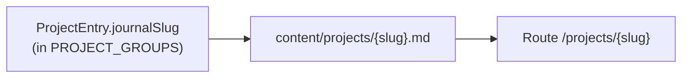

# Agent guide

## Project summary

Personal portfolio site built with the Next.js App Router. The project index lives at `/projects`; long-form journal write-ups live at `/projects/[slug]` and are sourced from Markdown files on disk.

## Stack (pinned to this repo)

- **Next.js** 16.x (`next` 16.1.1), **React** 19.x, **TypeScript** strict
- **Tailwind CSS** 4 with `@tailwindcss/postcss` (see `postcss.config.mjs`) and `@tailwindcss/typography`
- **Markdown:** `react-markdown`, `remark-gfm`, `gray-matter`
- **Icons / analytics:** `@fortawesome/react-fontawesome` (+ free icon packs), `@vercel/analytics`
- **SVG as React components:** `@svgr/webpack` (wired in `next.config.ts` for Turbopack and webpack)
- **Also in `package.json` but unused in app code:** `rehype-raw`, `rehype-slug` — available if needed; do not assume raw HTML in posts until they are wired into `ReactMarkdown`

## Commands

- `npm run dev` — development server
- `npm run build` — production build
- `npm run start` — production server (after `npm run build`)
- `npm run lint` — ESLint (no test runner in this repo)

## Repository map (high signal)

- `app/` — routes, `layout.tsx` (root metadata), `globals.css`, `fonts.ts`, `sitemap.ts`, `robots.ts`
- `components/` — UI; most files are Server Components (see React boundaries below)
- `lib/` — `projects.ts` (listing data), `project-posts.ts` (Markdown I/O), `cn.ts`, `site-url.ts`
- `content/projects/` — journal `.md` files (one per slug)
- `public/` — static assets; journal media under `public/projects/{slug}/`
- `components/assets/` — SVGs imported via `@assets/*` (`tsconfig.json` path alias; `@svgr/webpack` in `next.config.ts`)

## Content model (critical)

Two layers must stay aligned when adding or changing content.

### Listing rows

- [`lib/projects.ts`](lib/projects.ts) exports `PROJECT_GROUPS` and the `ProjectEntry` type.
- Optional `journalSlug` must match the stem of `content/projects/{slug}.md` (same `{slug}` as the filename without `.md`).
- On the projects page ([`app/projects/page.tsx`](app/projects/page.tsx)), the row title links to `/projects/{journalSlug}` when `journalSlug` is set (otherwise `href` or plain text per row logic).

### Journal posts

- [`lib/project-posts.ts`](lib/project-posts.ts) reads `content/projects/*.md` with `gray-matter`.
- Frontmatter **must** include `title`, `date` (parseable ISO string; invalid dates throw at build/read time), and `description` (non-empty strings).
- `getAllSlugs()` returns slugs sorted by `date` descending.
- Unsafe slugs (`..`, `/`, `\`, or empty) make `getPostBySlug` return `null`.

### Static routes

- [`app/projects/[slug]/page.tsx`](app/projects/[slug]/page.tsx) exports `generateStaticParams()` from `getAllSlugs()`; a missing or invalid post triggers `notFound()`.

### Diagram

## Markdown authoring

- **Media:** Put binaries for a post under `public/projects/{slug}/` and reference them as `/projects/{slug}/your-file.png` (same `{slug}` as the `.md` stem). Next serves `public/` at the site root.
- **Placeholders:** Until per-post art exists, mocks may use existing site assets (e.g. ``) so builds stay green.
- **Internal links:** Use paths starting with `/`; the post page maps those to `next/link` via custom `react-markdown` components ([`app/projects/[slug]/page.tsx`](app/projects/[slug]/page.tsx)).
- **External links:** `http…` URLs get `target="_blank"` and `rel="noopener noreferrer"` in the same custom link renderer.
- **Typography:** The article uses `@tailwindcss/typography` `prose` utilities on the wrapper; extend styling there for consistency.

## SEO and canonical URLs

- [`lib/site-url.ts`](lib/site-url.ts): `resolveSiteUrl()` prefers `NEXT_PUBLIC_SITE_URL` (trailing slashes stripped), then `https://${VERCEL_URL}`, then `http://localhost:3000`.
- Used for `metadataBase` in [`app/layout.tsx`](app/layout.tsx) and for absolute URLs in [`app/sitemap.ts`](app/sitemap.ts) and [`app/robots.ts`](app/robots.ts).
- **Production:** Set `NEXT_PUBLIC_SITE_URL` so Open Graph, sitemap, and robots URLs are not localhost.

## Metadata patterns

- Root [`app/layout.tsx`](app/layout.tsx) sets default `title`, `description`, Open Graph, and Twitter metadata on `metadataBase` from `resolveSiteUrl()`.
- [`app/projects/page.tsx`](app/projects/page.tsx) sets page metadata with `alternates.canonical: '/projects'`.
- Post pages use `generateMetadata` with `alternates.canonical` as the post path, Open Graph `type: 'article'`, and `publishedTime` from frontmatter `date`.

## React boundaries

- Default to **Server Components** unless you need client-only APIs.
- Files with `'use client'` or `"use client"` (grep `use client` in `*.ts` / `*.tsx`): [`components/StatusBar.tsx`](components/StatusBar.tsx), [`components/Footer.tsx`](components/Footer.tsx), [`components/HowTechList.tsx`](components/HowTechList.tsx), [`components/NavLink.tsx`](components/NavLink.tsx). Prefer small leaf components for new interactivity.

## Styling

- Tailwind via `@import "tailwindcss"` and `@plugin "@tailwindcss/typography"` in [`app/globals.css`](app/globals.css).
- Theme: `@theme` / `@theme inline` bridge CSS variables (including `--background`, `--foreground` on `:root`) into Tailwind; `--content-container-max-width` drives layout width.
- Utilities in `@layer components`: `.content-container`, `.section__paragraph`, `.fade-up`, `.section-grid`, etc.
- Custom breakpoints: `xs` (460px), `layout` (900px) in `@theme`.

## Code style

- **Imports:** Absolute paths with `@/*`; type-only imports with `import type`.
- **Components:** PascalCase; default exports for pages/components, named exports for utilities.
- **TypeScript:** Strict; define props interfaces before components; use `Readonly<>` for props; explicit annotations where it helps clarity.
- **React:** Semantic HTML; accessibility (`aria-label`, `alt`); focus-visible styling.
- **Formatting:** Trailing commas; **prefer** single quotes — some files mix quote styles; match the nearest file when editing, but new code should prefer single quotes.
- **Patterns:** Destructure props in the signature; use `React.ReactNode` for children.

## Quality gates

Before shipping content or route changes: `npm run lint` and `npm run build` (no automated tests in this repo).
