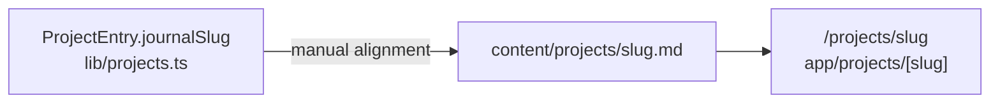

# ADR 0001: Projects index and journal write-ups

**Status:** Accepted  
**Date:** 2026-05-25

## Context

The portfolio needs a public **projects index** at `/projects` and optional **long-form write-ups** at `/projects/[slug]`. Requirements:

- No headless CMS or database—content should live in the repo and deploy with the site.
- A solo maintainer edits listings and journals infrequently.
- The site already uses the Next.js App Router with static generation where possible.
- The index must support rows **without** a journal (confidential work, external-only links, minimal rows) and rows **with** rich metadata (company, tags, period, secondary links).

Agent onboarding for day-to-day edits lives in [`AGENTS.md`](../../AGENTS.md). This record captures **why** the architecture was chosen and what trade-offs it implies.

## Decision

### Two-layer content model

We split **listing data** and **journal posts** into separate sources, linked manually by slug.

| Layer | Location | Consumed by |
| ----- | -------- | ----------- |
| Index listings | [`lib/projects.ts`](../../lib/projects.ts) — `PROJECT_GROUPS` / `ProjectEntry` | [`app/projects/page.tsx`](../../app/projects/page.tsx) |
| Journal posts | [`content/projects/{slug}.md`](../../content/projects/) | [`lib/project-posts.ts`](../../lib/project-posts.ts) → [`app/projects/[slug]/page.tsx`](../../app/projects/[slug]/page.tsx) |

- Listing fields: `title`, `period`, optional `company`, `tags`, `summary`, `href`, and optional `journalSlug`.
- Journal frontmatter (required): `title`, `date` (ISO 8601), `description`. Body is GitHub-flavored Markdown.
- **Linkage:** When set, `journalSlug` on a `ProjectEntry` must equal the Markdown filename stem (`portfolio-site` ↔ `content/projects/portfolio-site.md`). This contract is **not validated at compile time**; maintainers keep the two layers aligned.

### File-based Markdown instead of a CMS

Journal content is version-controlled Markdown parsed with `gray-matter`, rendered with `react-markdown` and `remark-gfm`. Dependencies `rehype-raw` and `rehype-slug` are present but **not wired**—raw HTML in posts is not supported until explicitly enabled.

### Static generation for journal routes

- [`generateStaticParams`](../../app/projects/[slug]/page.tsx) builds one page per slug from `getAllSlugs()` (newest `date` first).
- `getPostBySlug` returns `null` for missing files or unsafe slugs (`..`, `/`, `\`); the page calls `notFound()`.
- Invalid or missing frontmatter throws at read time so broken posts fail the build early.

### Index title and link behavior

On the index, `ProjectTitle` resolves links in this order:

1. **`journalSlug` set** → `Link` to `/projects/{journalSlug}` (journal is the primary destination).
2. **No `href`** → plain text (no link).
3. **`href` set** → internal `Link` if `href` starts with `/`, otherwise external `<a>` with `target="_blank"` and `rel="noopener noreferrer"`.

When both `journalSlug` and `href` exist and differ (e.g. journal plus site home), `ProjectRow` shows a **secondary** link below the summary.

### Markdown rendering on journal pages

- The post route is an **async Server Component** (no client bundle for the article).
- Custom `react-markdown` components: paths starting with `/` use `next/link`; `http` URLs open in a new tab with `rel="noopener noreferrer"`.
- Images use a plain `` (not `next/image`) so arbitrary paths from Markdown work; media lives under `public/projects/{slug}/` and is referenced as `/projects/{slug}/file.png`.
- Article typography uses `@tailwindcss/typography` `prose` utilities on the wrapper.

### SEO

- Index: static `metadata` with canonical `/projects`.
- Posts: `generateMetadata` with canonical `/projects/{slug}`, Open Graph `type: 'article'`, and `publishedTime` from frontmatter `date`.
- [`app/sitemap.ts`](../../app/sitemap.ts) includes `/projects` and every journal slug from `getAllSlugs()`.

## Alternatives considered

| Alternative | Why not chosen |
| ------------- | -------------- |
| Single source (derive index only from Markdown) | Index needs rows without posts and flexible row shapes (tags-only, no company, confidential entries). |
| Headless CMS | Extra infrastructure and coupling for a personal portfolio. |
| MDX | Heavier pipeline; GFM plus custom link/image components are enough for now. |
| `next/image` in Markdown | Harder to support arbitrary markdown image paths; deferred. |
| Build-time validation of `journalSlug` ↔ files | Adds scripting complexity; manual alignment accepted for v1. |

## Consequences

### Positive

- Zero runtime content API; predictable static output.
- Listings and journals can evolve independently (short index row vs long article).
- Full git history and review workflow for copy changes.
- Invalid journal frontmatter surfaces at build time.

### Negative

- **Dual maintenance:** Adding a linked journal requires both a `.md` file and a listing row with matching `journalSlug`.
- **No compile-time link check:** `journalSlug` pointing at a missing file yields a 404; a `.md` file without a listing row still builds and appears in the sitemap (**orphan post**).
- Mock journal copy remains until replaced; the architecture does not enforce content quality.

### Operational guide

**Add a project with a journal write-up:**

1. Create `content/projects/{slug}.md` with valid frontmatter and body.
2. Add or update a `ProjectEntry` in `lib/projects.ts` with `journalSlug: '{slug}'`.
3. Put images under `public/projects/{slug}/` and reference them as `/projects/{slug}/filename.ext`.
4. Run `npm run lint` and `npm run build`.

**Add an index-only row:** Edit `PROJECT_GROUPS` only; omit `journalSlug`.

**Related docs:** [`AGENTS.md`](../../AGENTS.md) — stack, commands, and content conventions for agents and contributors.
